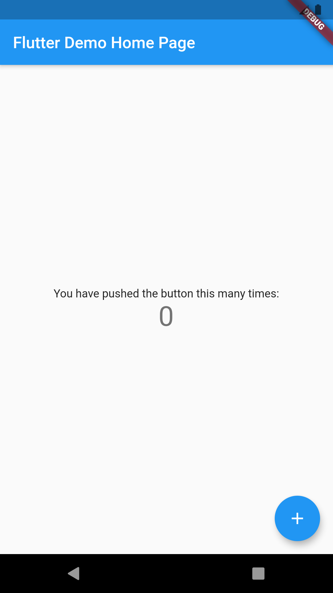

# 카운팅앱 만들기

{: width="100" height="100"}

>**step 1. main 함수 만들기**
>```dart
>import 'package:flutter/material.dart';
> 
>//MyApp()을 실행시켜라.
>void main() => runApp(MyApp());
>```

<br>

>**step 2. MyApp을 만들기 (stateless 사용)**
>
> stateless vs stateful<br>
> 1. stateless : 사용자의 동작과 상호작용이 필요없는 위젯을 사용할 때(container, row, column, icon, text 등)<br>
> 2. stateful : 상태를 가질 수 있는 위젯을 사용할 때(CheckBox, Slider 등의 위젯)<br>
>```
> 이 두 개를 나눠놓은 이유는? LifeCycle이 다르기 때문.
>                           (stateful은 사용자와 상호작용할 때 마다 새로 업데이트)
>```
> 사용법 : st라고 치면 선택창이 뜬다. 
>```dart
>class MyApp extends StatelessWidget {
>  @override
>  Widget build(BuildContext context) { //MaterialApp 앱을 빌드
>    return MaterialApp(
>      title: 'Flutter Demo',
>      theme: ThemeData(primarySwatch: Colors.purple), 
>      home: MyHomePage(title: 'Flutter Demo Home Page')
>    ); //material app으로 만들기
>  }
>}
>```
> 추가설명>
> ```
> MaterialApp() : 앱으로서 기능을 할 수 있도록 해주는 뼈대 (주로 title과 theme 사용)

<br>

>**step 3. MyHomePage를 만들기(statefull사용)**
>```dart
>//위의 title부분 받아오기
>class MyHomePage extends StatefulWidget {
>   MyHomePage({Key? key, required this.title}) : super(key: key);
>   final String title;
>
>   @override
>   _MyHomePageState createState() => _MyHomePageState();
>}
>
>class _MyHomePageState extends State<MyHomePage> {
>   @override
>   Widget build(BuildContext context) {
>      return Scaffold();
>   }
>}
>```
> 추가설명>
> ```
> Scaffold() : 구성된 앱에서 디자인적인 부분에서의 뼈대
>```
>

<br>

>**step 4. Scaffold에 요소 넣기**
>```dart
>class _MyHomePageState extends State<MyHomePage> {
>      . . .//생략
>   return Scaffold(
>       appBar: AppBar(title:Text(widget.title) ),  //상단바 만들기
>       body: Center(
>           child: Column(mainAxisAlignment: MainAxisAlignment.center,  //column을 이용하여 순차적으로 밑으로 배열
>           children: <Widget>[
>               Text('You have pushed the button this many times:'),
>               Text('Counter', style: Theme.of(context).textTheme.display1)  //textTheme 중에 display1 theme를 적용해라.
>           ])
>       ),
>   );
>}
>```
>


>**step 4. Scaffold에 요소 넣기**
>```
>// 변수 선언
>private (함수나 클래스 내부에서만 사용) -> <자료형> <_변수이름>
>public -> <자료형> <변수이름>
>
>// 변수 사용 방법 -> '$변수이름'
>```
>```dart
>class _MyHomePageState extends State<MyHomePage> {
>   int _counter = 0;
>   . . . //생략
>        Text('Counter', style: Theme.of(context).textTheme.display1) //이 'counter' 부분 수정하기
>       ->Text('$_counter', style: Theme.of(context).textTheme.display1)
>```

<br>

>**step 5. counter 기능 구현하기**
>```dart
>class _MyHomePageState extends State<MyHomePage> {
>   . . . //생략
>
>   Widget build(BuildContext context) {
>          . . . //생략 (center 뒤에 넣기) 
>      
>          floatingActionButton: FloatingActionButton(
>             tooltip: 'Increment',
>             onPressed: _incrementCounter,
>             child: Icon(Icons.add)
>          ),
>       );
>   }
>
>   void _incrementCounter() {
>       setState((){
>          _counter++;
>       });
>    }
>}

<br>

**알아두면 좋은 단축키**

1. control+space -> 추천 코드들

2. 에러에 Alt+enter -> 에러 고칠 수 있는 해결책
  
  
<br><br>
## 추가 
